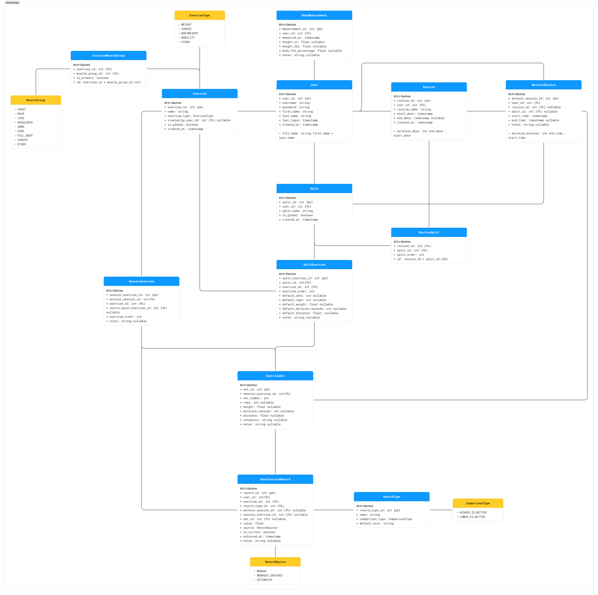

# Workout tracker

This is an app that logs a user's workouts. 

## How to start

Clone this repo and go to the folder in terminal.

```sh
git clone git@github.com:tjaung/workout_tracker.git && cd workout_tracker
docker compose up --build
```

- Client: http://localhost:5173
- Server: http://localhost:8000
- Postgres: localhost:5432

On startup it seeds data. There is a test user with mock data. Login with username: test password: test to view a sample user

## About

This is a workout tracker app complete with adding routines, starting workouts from them or making one off workouts, tracking body measurements, and analytics for body comp, exercise progress, workouts, and records.

At the home page, you can directly start your next workout if you are following a routine. Otherwise, you have the option to start an empty workout and choose from a publicly available list of exercises.

The workouts tab has the same current workout and start workout buttons. underneath it has some workout history logs where you can filter to see lists of workouts across different time periods, routines, and splits. Included is a plot of your cumulative workouts for a given time period.

The routines tab allows you to see what routines you have saved. You can also either add a pre existing routine from a public list, or create your own custom one. You have the option of setting it as active. 

Users can create routines and share these to the public if they wish. If it's shared, then other users can choose that created routine from the pre existing routines list.

The progress tab shows different analytics for your recorded body compositions, exercises, how long you've done a routine for, and simple stats at the top.

Records shows simple stats of 1 rep maxes, max reps done, max sets done, or for cardio, fastest mile time, longest duration, etc. If a user hasn't input this, the server estimates these numbers based on past workout data.

The settings tab allows a user to edit accessibility (lefthanded for mobile), change themes, and edit account info.

### Client

I took the color scheme from here: https://dribbble.com/shots/26262162-Titan-Fitness-Color-Palette

### ERD

This is the initial ERD when planning the app. Along the way, some things had to be added, like additional Enums, models, and fields. However, it still adheres to this plan about 95% of the way. Having it modeled this way allows for 


